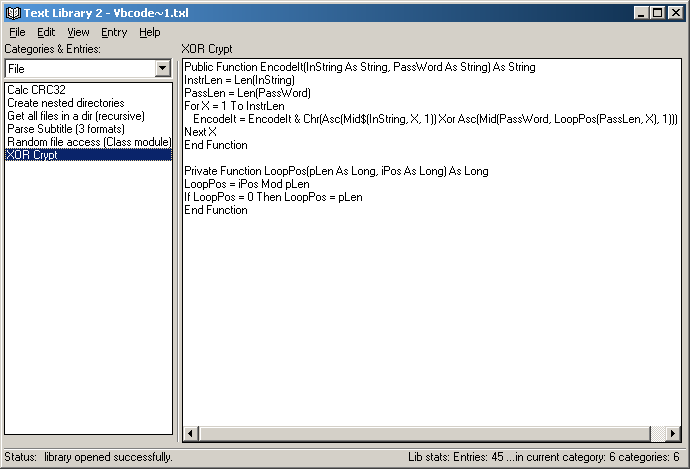



## FileLib2/TextLib2

### Description

FileLib2 is a class module for handling a big file that contain other files. Useful for storing small files if you have big cluster size.

TextLib2 is a text database program using FileLib2.

Yeah, i know that this doesn't sound good, but it's fast, and easy to use (...and my english is bad).
 
### More Info
 

             |
---                |---
**Submitted On**   |2004-04-14 11:26:26
**By**             |[Mihály Tallódi](https://github.com/Planet-Source-Code/PSCIndex/blob/master/ByAuthor/mih-ly-tall-di.md)
**Level**          |Intermediate
**User Rating**    |4.7 (14 globes from 3 users)
**Compatibility**  |VB 6\.0
**Category**       |[Files/ File Controls/ Input/ Output](https://github.com/Planet-Source-Code/PSCIndex/blob/master/ByCategory/files-file-controls-input-output__1-3.md)
**World**          |[Visual Basic](https://github.com/Planet-Source-Code/PSCIndex/blob/master/ByWorld/visual-basic.md)
**Archive File**   |[FileLib2\_T1733864152004\.zip](https://github.com/Planet-Source-Code/mih-ly-tall-di-filelib2-textlib2__1-53180/archive/master.zip)

